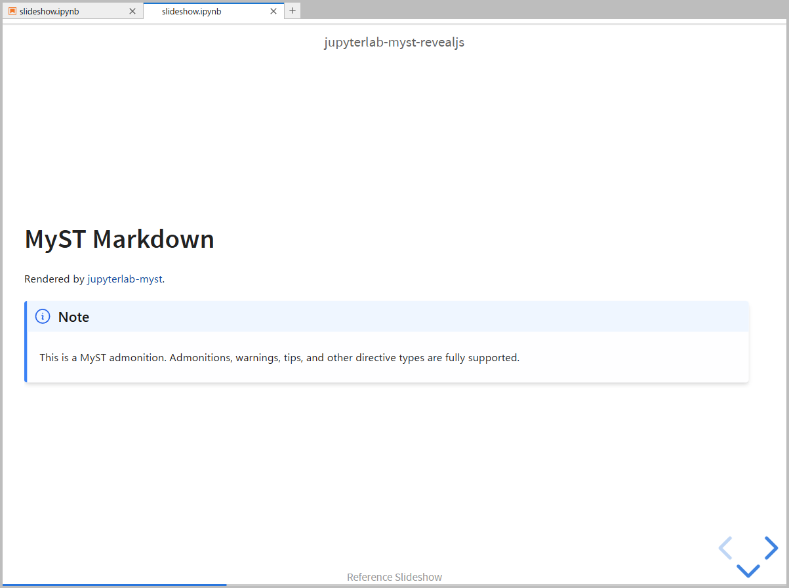

# jupyterlab-myst-revealjs

[](https://github.com/CojiroSasaki/jupyterlab-myst-revealjs/actions/workflows/build.yml)

Live [reveal.js](https://revealjs.com/) slideshow for [MyST Markdown](https://mystmd.org/) notebooks in JupyterLab.



Open any notebook as a slideshow panel beside the notebook editor. Markdown cells are rendered via [jupyterlab-myst](https://github.com/jupyter-book/jupyterlab-myst), code cells use JupyterLab's native CodeCell widget — execute code and see results on slides in real time.

## Features

- **reveal.js slideshow** — present notebooks as reveal.js slides directly in JupyterLab
- **Slide structure** — `slide`, `subslide`, `fragment`, `skip` via cell metadata
- **MyST Markdown** — admonitions, math, cross-references, and all MyST directives
- **Live code execution** — Shift+Enter runs code cells on slides (shared kernel with notebook)
- **Cell tags**
  - Jupyter Book compatible — `hide-input`, `hide-output`, `hide-cell`, `remove-input`, `remove-output`, `remove-cell`
  - Grid layout — `gridwidth-*` tags for multi-column layouts
- **Customization**
  - Slide backgrounds — per-slide background color/image via cell metadata
  - Themes — 6 bundled reveal.js themes (black, white, dracula, serif, and more)
  - Custom CSS — drop a `myst-revealjs.css` next to your notebook for custom styling
  - Header / Footer — CSS-based overlays customizable via `myst-revealjs.css`
- **Keyboard controls**
  - Code visibility toggle — `i` / `o` keys to toggle input/output on focused code cells during the slideshow
  - Fullscreen / Overview — `f` for fullscreen, `o` for slide overview

## Requirements

- JupyterLab >= 4.0.0
- [jupyterlab-myst](https://github.com/jupyter-book/jupyterlab-myst)
- [jupyterlab-gridwidth](https://github.com/timkpaine/jupyterlab_gridwidth) (optional — for `gridwidth-*` tag preview in notebook view)

## Install

```bash
pip install jupyterlab-myst-revealjs
```

No Node.js required — this is a prebuilt extension.

## Uninstall

```bash
pip uninstall jupyterlab-myst-revealjs
```

## Quick Start

1. Open a notebook in JupyterLab.
2. Click the **slideshow button** in the toolbar, or run `slideshow:open` from the Command Palette.
3. Set slide types via the Property Inspector (right sidebar).
4. Press **Shift+Enter** on code cells to execute them on slides.

## Configuration

Add a `myst-revealjs` key to your notebook metadata to configure reveal.js options:

```json
{
  "myst-revealjs": {
    "theme": "white",
    "transition": "fade",
    "slideNumber": true
  }
}
```

See the [documentation](https://github.com/CojiroSasaki/jupyterlab-myst-revealjs/tree/main/docs) for full configuration options, cell metadata reference, and migration guide from RISE.

## Development

### Building

```bash
uv venv && uv pip install -e ".[dev]"
jlpm install && jlpm build
jupyter labextension develop . --overwrite
```

Run `jlpm watch` in one terminal and `jupyter lab` in another for live development.

### Testing

```bash
jlpm test                    # Unit tests (Jest)
cd ui-tests && jlpm test     # E2E tests (Playwright + Galata)
```

See [CONTRIBUTING](https://github.com/CojiroSasaki/jupyterlab-myst-revealjs/blob/main/docs/developer-guide/contributing.md) for details.

## License

MIT
